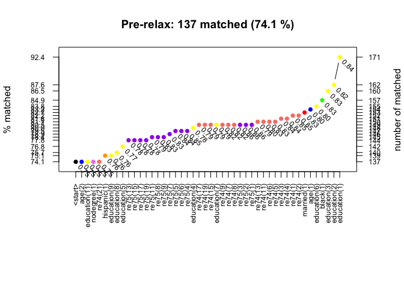

<!-- README.md is generated from README.Rmd. Please edit that file -->

# About `lalonde`

[](https://travis-ci.org/jjchern/lalonde)
[](https://ci.appveyor.com/project/jjchern/lalonde)
[](https://cran.r-project.org/package=lalonde)

The Lalonde datasets are widely used in the causal inference literature.
The current package makes loading such datasets in R easier. I found
myself calling the following command

``` r
haven::read_dta("http://www.nber.org/~rdehejia/data/nsw_dw.dta")
```

in several R projects. It might be easier to just type
`lalonde::nsw_dw`.

# Data and Source

  - NSW Data Files (Lalonde Sample)
      - `lalonde::nsw`
      - These files contain the treated and control units from the male
        sub-sample from the National Supported Work Demonstration as
        used by Lalonde in his paper.
  - NSW Data Files (Dehejia-Wahha Sample)
      - `lalonde::nsw_dw`
      - Based on pre-intervention variables, Dehejia-Wahha extract a
        further subset of Lalonde’s NSW experimental data, a subset
        containing information on RE74 (earnings in 1974).
  - Non-experimental Comparison Data Files:
      - `lalonde::psid_controls`
      - `lalonde::psid_controls2`
      - `lalonde::psid_controls3`  
      - `lalonde::cps_controls`
      - `lalonde::cps_controls2`
      - `lalonde::cps_controls3`
  - All the datasets are available in `txt` and `dta` format from
    Dehejia’s [website](http://users.nber.org/~rdehejia/nswdata2.html)

# Installation

``` r
# install.packages("devtools")
devtools::install_github("jjchern/lalonde")
```

# Usage

The datasets print nicely in the tidyverse:

``` r
library(tidyverse)

lalonde::nsw
#> # A tibble: 722 x 10
#>    data_id treat   age education black hispanic married nodegree  re75
#>    <chr>   <dbl> <dbl>     <dbl> <dbl>    <dbl>   <dbl>    <dbl> <dbl>
#>  1 Lalond…     1    37        11     1        0       1        1     0
#>  2 Lalond…     1    22         9     0        1       0        1     0
#>  3 Lalond…     1    30        12     1        0       0        0     0
#>  4 Lalond…     1    27        11     1        0       0        1     0
#>  5 Lalond…     1    33         8     1        0       0        1     0
#>  6 Lalond…     1    22         9     1        0       0        1     0
#>  7 Lalond…     1    23        12     1        0       0        0     0
#>  8 Lalond…     1    32        11     1        0       0        1     0
#>  9 Lalond…     1    22        16     1        0       0        0     0
#> 10 Lalond…     1    33        12     0        0       1        0     0
#> # … with 712 more rows, and 1 more variable: re78 <dbl>

lalonde::nsw_dw
#> # A tibble: 445 x 11
#>    data_id treat   age education black hispanic married nodegree  re74
#>    <chr>   <dbl> <dbl>     <dbl> <dbl>    <dbl>   <dbl>    <dbl> <dbl>
#>  1 Deheji…     1    37        11     1        0       1        1     0
#>  2 Deheji…     1    22         9     0        1       0        1     0
#>  3 Deheji…     1    30        12     1        0       0        0     0
#>  4 Deheji…     1    27        11     1        0       0        1     0
#>  5 Deheji…     1    33         8     1        0       0        1     0
#>  6 Deheji…     1    22         9     1        0       0        1     0
#>  7 Deheji…     1    23        12     1        0       0        0     0
#>  8 Deheji…     1    32        11     1        0       0        1     0
#>  9 Deheji…     1    22        16     1        0       0        0     0
#> 10 Deheji…     1    33        12     0        0       1        0     0
#> # … with 435 more rows, and 2 more variables: re75 <dbl>, re78 <dbl>
```

Combine the treatment group from `lalonde::nsw_dw` with a
non-experimental comparison group from the Panel Study of Income
Dynamics (PSID):

``` r
lalonde::nsw_dw %>% 
    filter(treat == 1) %>% 
    bind_rows(lalonde::psid_controls) %>% 
    select(-data_id) %>% 
    print() -> df
#> # A tibble: 2,675 x 10
#>    treat   age education black hispanic married nodegree  re74  re75   re78
#>    <dbl> <dbl>     <dbl> <dbl>    <dbl>   <dbl>    <dbl> <dbl> <dbl>  <dbl>
#>  1     1    37        11     1        0       1        1     0     0  9930.
#>  2     1    22         9     0        1       0        1     0     0  3596.
#>  3     1    30        12     1        0       0        0     0     0 24909.
#>  4     1    27        11     1        0       0        1     0     0  7506.
#>  5     1    33         8     1        0       0        1     0     0   290.
#>  6     1    22         9     1        0       0        1     0     0  4056.
#>  7     1    23        12     1        0       0        0     0     0     0 
#>  8     1    32        11     1        0       0        1     0     0  8472.
#>  9     1    22        16     1        0       0        0     0     0  2164.
#> 10     1    33        12     0        0       1        0     0     0 12418.
#> # … with 2,665 more rows

# install.packages("skimr")
skimr::skim(df)
#> Skim summary statistics
#>  n obs: 2675 
#>  n variables: 10 
#> 
#> ── Variable type:numeric ─────────────────────────────────────────────────────────────────────────
#>   variable missing complete    n      mean       sd p0     p25      p50
#>        age       0     2675 2675    34.23     10.5  17   25       32   
#>      black       0     2675 2675     0.29      0.45  0    0        0   
#>  education       0     2675 2675    11.99      3.05  0   10       12   
#>   hispanic       0     2675 2675     0.034     0.18  0    0        0   
#>    married       0     2675 2675     0.82      0.38  0    1        1   
#>   nodegree       0     2675 2675     0.33      0.47  0    0        0   
#>       re74       0     2675 2675 18230     13722.25  0 8816.7  17437.47
#>       re75       0     2675 2675 17850.89  13877.78  0 7605.29 17008.06
#>       re78       0     2675 2675 20502.38  15632.52  0 9243.4  19432.1 
#>      treat       0     2675 2675     0.069     0.25  0    0        0   
#>       p75      p100     hist
#>     43.5      55    ▃▇▇▅▃▃▅▃
#>      1         1    ▇▁▁▁▁▁▁▃
#>     14        17    ▁▁▁▂▂▇▂▅
#>      0         1    ▇▁▁▁▁▁▁▁
#>      1         1    ▂▁▁▁▁▁▁▇
#>      1         1    ▇▁▁▁▁▁▁▃
#>  25470.47 137148.69 ▇▆▁▁▁▁▁▁
#>  25583.71 156653.23 ▇▅▁▁▁▁▁▁
#>  28815.67 121173.58 ▇▇▃▁▁▁▁▁
#>      0         1    ▇▁▁▁▁▁▁▁
```

The unadjusted difference in means is -$15,205:

``` r
df %>% 
    group_by(treat) %>% 
    summarise(mean_re78 = mean(re78)) %>% 
    print() %>% 
    spread(treat, mean_re78, sep = "_") %>% 
    mutate(diff = treat_1 - treat_0)
#> # A tibble: 2 x 2
#>   treat mean_re78
#>   <dbl>     <dbl>
#> 1     0    21554.
#> 2     1     6349.
#> # A tibble: 1 x 3
#>   treat_0 treat_1    diff
#>     <dbl>   <dbl>   <dbl>
#> 1  21554.   6349. -15205.
```

The naive estimate is certainly biased, because the treated group looks
very different from the control group:

``` r
# install.packages("cem")
cem::imbalance(group = df$treat, 
               data  = as.data.frame(df),
               drop  = c("treat", "re78"))
#> 
#> Multivariate Imbalance Measure: L1=0.986
#> Percentage of local common support: LCS=1.4%
#> 
#> Univariate Imbalance Measures:
#> 
#>               statistic   type         L1 min        25%       50%
#> age       -9.034386e+00 (diff) 0.18616086  -1     -6.000     -8.00
#> education -1.770922e+00 (diff) 0.44048627   4     -2.000     -1.00
#> black      5.926408e-01 (diff) 0.59264083   0      1.000      1.00
#> hispanic   2.692934e-02 (diff) 0.02692934   0      0.000      0.00
#> married   -6.770759e-01 (diff) 0.67707587   0     -1.000     -1.00
#> nodegree   4.028872e-01 (diff) 0.40288722   0      0.000      1.00
#> re74      -1.733317e+04 (diff) 0.00000000   0 -10775.967 -18417.11
#> re75      -1.753128e+04 (diff) 0.00000000   0  -9846.774 -17903.23
#>                 75%       max
#> age          -15.00      -7.0
#> education     -2.00      -1.0
#> black          0.00       0.0
#> hispanic       0.00       0.0
#> married       -1.00       0.0
#> nodegree       0.00       0.0
#> re74      -25158.63 -102108.6
#> re75      -24679.49 -131511.0
```

The multivariate imbalanced meaure is close to 1, suggesting an almost
complete separation between the treated and control group. The
differences in the empirical quantiles of the two distributions also
indicate a large amount of imbalance for many covariates. For example,
the treated group tends to be younger, has fewer years of education, are
less likely to be married, and earns a lot less in 1974 and 1975.

Matching on the covariates can help to create a matching sample in which
the matched control group is more comparable to the treated group. Below
we call the `cem()` function to implement an automatic coarsened exact
matching (CEM):

``` r
cem::cem(treatment = "treat",
         data = as.data.frame(df), 
         verbose = TRUE, 
         keep.all = TRUE, 
         drop = "re78") -> cem
#> 
#> Using 'treat'='1' as baseline group
cem
#>             G0  G1
#> All       2490 185
#> Matched    146 129
#> Unmatched 2344  56
```

The `cem()` function includes the automatic cut points:

``` r
cem$breaks
#> $age
#>  [1] 17.00000 20.16667 23.33333 26.50000 29.66667 32.83333 36.00000
#>  [8] 39.16667 42.33333 45.50000 48.66667 51.83333 55.00000
#> 
#> $education
#>  [1]  0.000000  1.416667  2.833333  4.250000  5.666667  7.083333  8.500000
#>  [8]  9.916667 11.333333 12.750000 14.166667 15.583333 17.000000
#> 
#> $black
#>  [1] 0.00000000 0.08333333 0.16666667 0.25000000 0.33333333 0.41666667
#>  [7] 0.50000000 0.58333333 0.66666667 0.75000000 0.83333333 0.91666667
#> [13] 1.00000000
#> 
#> $hispanic
#>  [1] 0.00000000 0.08333333 0.16666667 0.25000000 0.33333333 0.41666667
#>  [7] 0.50000000 0.58333333 0.66666667 0.75000000 0.83333333 0.91666667
#> [13] 1.00000000
#> 
#> $married
#>  [1] 0.00000000 0.08333333 0.16666667 0.25000000 0.33333333 0.41666667
#>  [7] 0.50000000 0.58333333 0.66666667 0.75000000 0.83333333 0.91666667
#> [13] 1.00000000
#> 
#> $nodegree
#>  [1] 0.00000000 0.08333333 0.16666667 0.25000000 0.33333333 0.41666667
#>  [7] 0.50000000 0.58333333 0.66666667 0.75000000 0.83333333 0.91666667
#> [13] 1.00000000
#> 
#> $re74
#>  [1]      0.00  11429.06  22858.11  34287.17  45716.23  57145.29  68574.34
#>  [8]  80003.40  91432.46 102861.52 114290.57 125719.63 137148.69
#> 
#> $re75
#>  [1]      0.00  13054.44  26108.87  39163.31  52217.74  65272.18  78326.62
#>  [8]  91381.05 104435.49 117489.93 130544.36 143598.80 156653.23
```

Alternatively, we can supply some infomation to aid the CEM process. For
example, we can choose to discretize the variable `age`, `educ`, `re74`,
`re75` in the following way:

``` r
cut_age = seq(min(df$age), max(df$age), by = 15)
cut_educ = c(0, 6.5, 8.5, 12.5, 17)
cut_re74 = seq(0, max(df$re74), by = 5000)
cut_re75 = seq(0, max(df$re75), by = 5000)
cem::cem(treatment = "treat",
         data = as.data.frame(df), 
         verbose = TRUE, 
         keep.all = TRUE, 
         drop = "re78",
         cutpoints = list(age = cut_age,
                          educcation = cut_educ,
                          re74 = cut_re74,
                          re75 = cut_re75)) -> mat2
#> 
#> Using 'treat'='1' as baseline group
mat2
#>             G0  G1
#> All       2490 185
#> Matched    104 137
#> Unmatched 2386  48
```

Is there a way to improve the number of subjects who can be matched?

``` r
cem::relax.cem(obj = mat2, data = as.data.frame(df), verbose = FALSE)
```


